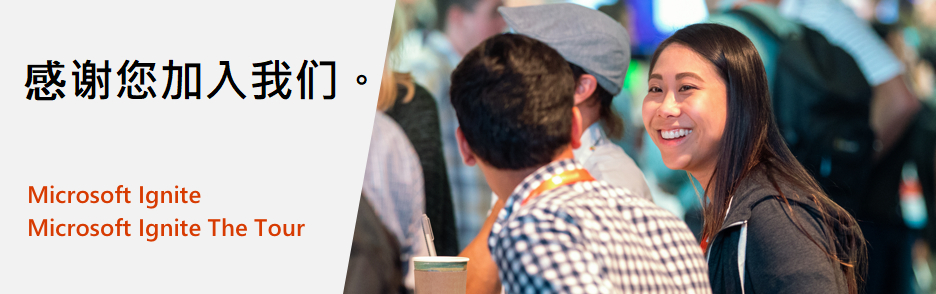

# Microsoft Ignite 和 Microsoft Ignite The Tour: 免费认证考试

感谢您参加 Microsoft Ignite 2019 或 Microsoft Ignite The Tour 2019-2020 活动。除某些例外情况外，所有参与者都将获得免费的认证考试，*以帮助您持续提升技能并向雇主和同行证明您的技术专长。

## 优惠详情

如果您参加了Microsoft Ignite 2019或Microsoft Ignite The Tour 2019-2020活动，则可能有资格获得一次免费的Microsoft基础、基于角色的考试或专业考试。您可从参加活动开始之日起兑换此次免费考试优惠，有效期为活动最后一天后的180天。如果您未在该时间段内安排考试，则将无法兑换您的优惠。  

##  您如何申领免费考试

由于这是一种数字式优惠，因此我们要求您在安排在线考试时间时，使用与活动注册相同的社交帐户（请参阅下面的步骤7）来验证您出席活动。如果您是团体注册，请确保您已填写活动注册资料。对于MS Ignite 2019参与者，请访问[https://register.ignite.microsoft.com/](https://register.ignite.microsoft.com/);对于Tour参与者，请访问[https://register.msignite-the-tour.microsoft.com/](https://register.msignite-the-tour.microsoft.com/)城市名称，例如[https://register.msignite-the-tour.microsoft.com/london](https://register.msignite-the-tour.microsoft.com/london) 以填写您的活动资料。

对于分步截图，[参见此处](https://query.prod.cms.rt.microsoft.com/cms/api/am/binary/RE4n1th)。

***为注册免费考试：***

1. 选择下面列出的任何合格考试。
2. 访问所需的考试详细信息页面后，单击“计划考试”按钮以开始在线注册过程。
3. 使用与您'Microsoft认证资料相关的Microsoft账号登录。  如果您没有Microsoft认证档案，则需要创建一个。
4. 登录您的Microsoft认证档案后，请确认认证档案中的详细信息正确无误。
5. 单击认证档案页面底部的“保存并继续按钮”，转到“考试折扣”页面。
6. 在“考试折扣”页面上，选择您已经参加的活动，然后单击“验证帐户”按钮。
7. 验证帐户时，您必须使用与活动注册时相同的社交帐户进行身份验证（注意：如果您在注册活动时使用Microsoft帐户，则必须使用相同的Microsoft帐户登录访问认证档案以安排考试。如果这导致出现两个认证档案，请联系[Microsoft认证支持论坛](https://trainingsupport.microsoft.com/zh-cn/mcp/forum?sort=LastReplyDate&dir=Desc&tab=All&status=all&mod=&modAge=&advFil=&postedAfter=&postedBefore=&threadType=All&isFilterExpanded=false&page=1)，以便在完成认证考试后合并您的档案。）
8. 请按照以下屏幕上的步骤进行操作，并提供所需的详细信息以安排考试时间。
9. 在结帐期间，请确认应付的总金额为$0.00并提交订单。  注意：“我的订单”页面底部应显示以下折扣： ***Microsoft Ignite 2019-2020 100% 折扣***。  考试安排流程中的前几页将显示全价。

***认证支持：***

对于安排考试的问题，请通过[Microsoft认证支持论坛](https://trainingsupport.microsoft.com/zh-cn/mcp/forum?sort=LastReplyDate&dir=Desc&tab=All&status=all&mod=&modAge=&advFil=&postedAfter=&postedBefore=&threadType=All&isFilterExpanded=false&page=1)获得帮助.论坛版主将在一个工作日内回复。

##  适用于此优惠的考试

此优惠包括所有Microsoft基础，基于角色的考试和专业考试。适用的考试如下所示。

| 按照产品 | 考试 |
| --- | --- |
| Azure | [AI-100: Designing and Implementing an Azure AI Solution](/learn/certifications/exams/ai-100) [AZ-103: Microsoft Azure Administrator](/learn/certifications/exams/az-103) [AZ-120: Planning and Administering Microsoft Azure for SAP Workloads](/learn/certifications/exams/az-120) [AZ-203: Developing Solutions for Microsoft Azure](/learn/certifications/exams/az-203) [AZ-300: Microsoft Azure Architect Technologies](/learn/certifications/exams/az-300) [AZ-301: Microsoft Azure Architect Design](/learn/certifications/exams/az-301) [AZ-400: Microsoft Azure DevOps Solutions](/learn/certifications/exams/az-400) [AZ-500: Microsoft Azure Security Technologies](/learn/certifications/exams/az-500) [AZ-900: Microsoft Azure Fundamentals](/learn/certifications/exams/az-900) [DP-100: Designing and Implementing a Data Science Solution on Azure](/learn/certifications/exams/dp-100) [DP-200: Implementing an Azure Data Solution](/learn/certifications/exams/dp-200) [DP-201: Designing an Azure Data Solution](/learn/certifications/exams/dp-201) |
| Dynamics 365 和 Power Platform | [MB-200: Microsoft Power Platform + Dynamics 365 Core](/learn/certifications/exams/mb-200) [MB-210: Microsoft Dynamics 365 Sales](/learn/certifications/exams/mb-210) [MB-220: Microsoft Dynamics 365 Marketing](/learn/certifications/exams/mb-220) [MB-230: Microsoft Dynamics 365 Customer Service](/learn/certifications/exams/mb-230) [MB-240: Microsoft Dynamics 365 Field Service](/learn/certifications/exams/mb-240) [MB-300: Microsoft Dynamics 365： Core Finance and Operations](/learn/certifications/exams/mb-300) [MB-310: Microsoft Dynamics 365 Finance](/learn/certifications/exams/mb-310) [MB-320: Microsoft Dynamics 365 Supply Chain Management, Manufacturing](/learn/certifications/exams/mb-320) [MB-330: Microsoft Dynamics 365 Supply Chain Management](/learn/certifications/exams/mb-330) [MB-400: Microsoft PowerApps + Dynamics 365 Developer](/learn/certifications/exams/mb-400) [MB-500: Microsoft Dynamics 365： Finance and Operations Apps Developer](/learn/certifications/exams/mb-500) [MB-600: Microsoft Power Platform + Dynamics 365 Solution Architect (直到2019年12月31日之后才能进行测试版考试)](/learn/certifications/exams/mb-600) [MB-700: Microsoft Dynamics 365：Finance and Operations Apps Solution Architect (直到2019年12月31日之后才能进行测试版考试)](/learn/certifications/exams/mb-700) [MB-900: Microsoft Dynamics 365 Fundamentals](/learn/certifications/exams/mb-900)  [PL-900: Microsoft Power Platform Fundamentals](/learn/certifications/exams/pl-900)|
| Microsoft 365 | [MD-100: Windows 10](/learn/certifications/exams/md-100) [MD-101: Managing Modern Desktops](/learn/certifications/exams/md-101) [MS-100: Microsoft 365 Identity and Services](/learn/certifications/exams/ms-100) [MS-101: Microsoft 365 Mobility and Security](/learn/certifications/exams/ms-101) [MS-200: Planning and Configuring a Messaging Platform](/learn/certifications/exams/ms-200) [MS-201: Implementing a Hybrid and Secure Messaging Platform](/learn/certifications/exams/ms-201) [MS-300: Deploying Microsoft 365 Teamwork](/learn/certifications/exams/ms-300) [MS-301: Deploying SharePoint Server Hybrid](/learn/certifications/exams/ms-301) [MS-500: Microsoft 365 Security Administration](/learn/certifications/exams/ms-500) [MS-600: Building Applications and Solutions with Microsoft 365 Core Services](/learn/certifications/exams/ms-600) [MS-700: Managing Microsoft Teams](/learn/certifications/exams/ms-700) [MS-900: Microsoft 365 Fundamentals](/learn/certifications/exams/ms-900) |

## 条款与条件

- 此考试优惠适用于已参加Microsoft Ignite 2019或Microsoft Ignite The Tour 2019-2020活动的合格人员。
- 该考试优惠可以兑换为一（1）次Microsoft认证考试，在经过授权的Pearson Vue测试中心或通过Pearson Vue在线代理站点参加此考试。
- 此考试优惠是针对特定考试的，并且只能用于选定的Microsoft考试。
此考试优惠的有效期为从您收到活动的第一天开始，到活动最后一天之后的第180天为止。
- 此考试优惠使您可以在优惠到期之前注册一（1）次考试。
- 此考试优惠的有效期在任何情况下都不能延长。
- 此考试优惠不适用于以下任何一种情况，也不能由以下人员兑换：1）政府官员； 或2）香港，瑞士，以色列，德国，俄罗斯或瑞典的居民。*此优惠不适用于政府官员或居民，如*所述，因为它超出了Microsoft政策和当地法律允许的限制。
- 此考试优惠只能兑换一次。
- 此考试优惠无法兑换或交换为现金、积分或退款。
- 此考试优惠不可转让，如果您以任何方式更改、修改或转让，则该优惠无效。
- 此考试优惠仅提供给已注册并参加官方Microsoft Ignite 2019或Microsoft Ignite The Tour 2019-2020活动的个人。

有关更多的信息，请参阅完整的[Microsoft使用条款](https://www.microsoft.com/zh-cn/legal/intellectualproperty/copyright/default.aspx?SilentAuth=1)

## 外部常见问题解答-MS Ignite和The Tour的免费考试优惠

### 关于报价

**问题：此优惠可以免费安排多少考试？**

**答：** 您可以通过此优惠申领一次免费的资格认证考试。

**问题：哪些认证考试可以使用此优惠？**

**答：** 此优惠包括所有Microsoft基础，基于角色的考试和专业考试。有关资格认证考试的列表，请参见我们的优惠详细信息页面上的“此优惠适用的资格考试”部分： [https://docs.microsoft.com/zh-cn/learn/certifications/microsoft-ignite-free-certification-exam-offer#eligible-exams-for-this-offer](https://docs.microsoft.com/zh-cn/learn/certifications/microsoft-ignite-free-certification-exam-offer#eligible-exams-for-this-offer).

**问题：如果我报名参加了一项资格活动但没有亲自参加，我仍然可以要求此优惠吗？**

**答：** 不，此优惠仅适用于亲自参加Microsoft Ignite 2019或Microsoft Ignite The Tour 2019-2020活动的人员。

**问题：为什么此优惠的条款和条件中规定香港，瑞士，以色列，德国，俄罗斯或瑞典居民不符合条件？**

**答：** 由于Microsoft的赠与政策和当地法律，这些地区的居民没有资格获得此优惠。这些国家/地区都有专门的法律，对任何公司向其居民提供的赠与作出限制，并且我们的认证考试的价值超出了该限制，因此，Microsoft无法为这些国家/地区的居民提供免费考试。

### 安排免费考试

**问题：在我参加或计划参加的活动期间，是否需要通过此优惠安排免费考试？**

**答：** 不，您无需在参加活动的过程中安排通过此优惠计划进行的免费考试。您可以在活动期间或活动结束后安排考试；免费考试的有效期为自活动结束之日起180个自然日之内。

**问题：我需要在活动结束后的180个自然日内参加考试吗？**

**答：** 是的，您确实需要在活动结束后的180个自然日内参加考试。

**问题：如何通过此优惠安排免费考试？**

**答：** 如需了解安排免费考试的指南，请访问[https://docs.microsoft.com/zh-cn/learn/certifications/microsoft-ignite-free-certification-exam-offer#how-to-claim-your-free-exam](https://docs.microsoft.com/zh-cn/learn/certifications/microsoft-ignite-free-certification-exam-offer#how-to-claim-your-free-exam).

**问题：在验证我的考试优惠资格时，我遇到一个错误，指出我不符合条件，因为我是政府官员，但我不是。我该怎么办？**

**答：** 如果您被误认为政府官员，则需要在活动登记档案中更新“政府”字段，并等到活动结束后才能查看资格。您也可以联系[Microsoft认证支持论坛](https://trainingsupport.microsoft.com/mcp/forum?sort=LastReplyDate&dir=Desc&tab=All&status=all&mod=&modAge=&advFil=&postedAfter=&postedBefore=&threadType=All&isFilterExpanded=false&page=1) ([https://aka.ms/CertificationSupport](https://aka.ms/CertificationSupport)) 以获得帮助。

**问题：我在安排免费考试时遇到了麻烦。我可以在哪里获得帮助？**

**答：** 您可以通过[Microsoft认证支持论坛](https://trainingsupport.microsoft.com/mcp/forum?sort=LastReplyDate&dir=Desc&tab=All&status=all&mod=&modAge=&advFil=&postedAfter=&postedBefore=&threadType=All&isFilterExpanded=false&page=1)获得帮助 ([https://aka.ms/CertificationSupport](https://aka.ms/CertificationSupport)).版主将在一个工作日内回复。

**问题：我可以选择现场或在线参加安排的考试吗？**

**答：** 是的，您可以选择在当地考试中心现场通过Pearson Vue参加考试或通过在线督导（OP）参加安排好的考试。如需了解有关在线考试的更多信息，请访问
[https://www.microsoft.com/zh-cn/learning/online-exams.aspx](https://www.microsoft.com/zh-cn/learning/online-exams.aspx)

### 取消和改期政策

**问题：如果需要，我可以通过此优惠重新安排考试预约吗？**

**答：** 是的，您可以重新安排考试的时间，但是必须在活动结束后的180天之内重新安排。您必须至少在预约考试时间的六个工作日之前重新安排考试时间，以免需要支付重新安排考试的费用。[参阅重新安排时间政策](https://microsoft.sharepoint.com/teams/MarketingTeam7/Shared%20Documents/FY20%20Ignite%20Flagship%20Event/Free%20Exam%20Voucher%20Offer%20and%20Nurture%20Stream/MS%20Ignite_FreeExam_Customer%20Journey.pptx).

**问题：重新安排或取消考试预约时需要付费吗？**

**答：** 如果您在约定考试时间的至少六个工作日之前重新安排或取消考试预约，则没有任何收费。如果您在考试时间前五个工作日内需要重新安排时间，则需要支付重新安排费用。在预定考试时间的两天内，可能无法重新安排或取消考试。如果您没有参加考试，那么您将失去此优惠的免费考试。有关更多信息，请参阅[取消和重新安排政策](https://docs.microsoft.com/zh-cn/learn/certifications/certification-exam-policies#cancellation-and-reschedule-policy).

**问题：如果我错过了预约的考试，并且没有重新安排或取消考试，该怎么办？**

**答：** 如果您错过了预约的考试，并且没有在预约考试时间的至少24小时之前重新安排或取消预约，则您将失去此优惠的免费考试。有关更多信息，请参阅[取消和重新安排政策](https://docs.microsoft.com/zh-cn/learn/certifications/certification-exam-policies#cancellation-and-reschedule-policy).

### 重考政策

**问题：如果未通过初次的免费认证考试，可以免费重考吗？**

**答：** 不可以，此优惠仅适用于一次考试，必须另外安排重考时间。有关重新参加认证考试的详细信息，请参阅我们的[重考政策](https://www.microsoft.com/zh-cn/learning/certification-exam-policies.aspx#policies-1).